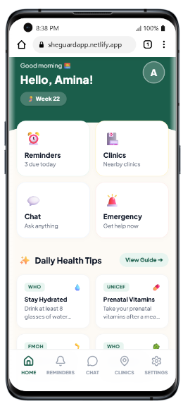
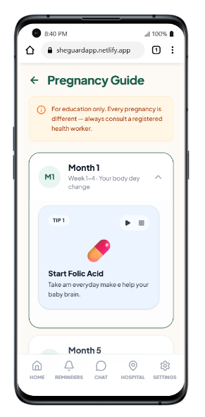
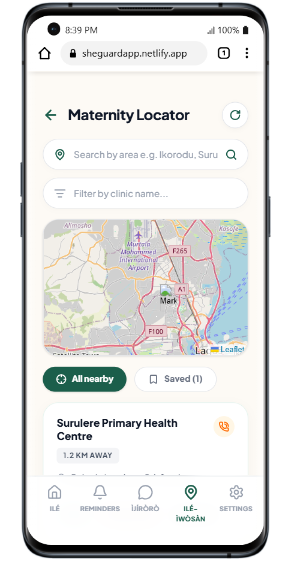
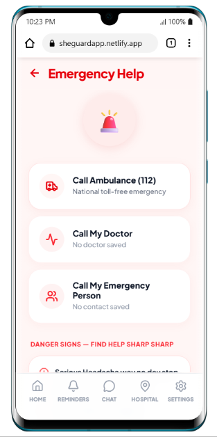

# SheGuard AI

**A Multilingual, Voice-First Maternal Health Companion for Expectant Mothers in Nigeria**

> **⚠️ DISCLAIMER: DEMO APPLICATION**
> This application is a Minimum Viable Product (MVP) web demo built specifically for the **HER Hackathon 2026**. It is currently a simulated frontend environment. It is not a real medical device, does not store data on a live backend, and the AI responses are currently simulated to demonstrate the user flow. **Always consult a registered healthcare worker for real medical emergencies.**

---

## Live Web Demo

You don't need to download anything to try SheGuard! The app is fully deployed and accessible via the web.

🔗 **[Click Here to Open SheGuard on Netlify](https://sheguardapp.netlify.app/)**
_(Note: For the best experience, view this on a mobile device or use your browser's Developer Tools to simulate a mobile screen)._

**📸 Scan to open on Mobile:**
![SheGuard QR Code]


---

## About the Project

**SheGuard AI** is an accessible, web-based mobile health companion built specifically for expectant mothers in Nigeria, with a strict focus on bridging the literacy and language gap for underserved and semi-rural communities.

Maternal mortality in Nigeria remains among the highest in the world. A significant proportion of preventable deaths are caused by the late recognition of danger signs—particularly preeclampsia, hemorrhage, and infection—that could have been identified and escalated hours earlier if the mother had understood the symptoms.

SheGuard aims to close that gap by putting a warm, culturally-aware, voice-first health companion directly in a mother's pocket, available in her own language.

### SheGuard is a triage and guidance tool that:

- **Bypasses the literacy barrier** via natural voice dictation and text-to-speech.
- **Detects danger signs** through conversation and raises immediate visual alerts.
- **Delivers trimester-specific**, evidence-based pregnancy guidance.
- **Connects mothers to nearby maternity facilities** using geospatial mapping.

---

## Screenshots

|              Home Dashboard              |              Pregnancy Guide               |                Clinic Locator                |                 Emergency Protocol                 |
| :--------------------------------------: | :----------------------------------------: | :------------------------------------------: | :------------------------------------------------: |
|  |  |  |  |

---

## Hackathon Project Team

This application was conceived, designed, and built for the HER Hackathon 2026 by Team SheGuard:

| Name                  | Role                                         |
| :-------------------- | :------------------------------------------- |
| **Ummulkhair Logun**  | Team Lead / Product & AI Strategy            |
| **Katrina Emegbagha** | Co-Lead / UX Design & Full-Stack Engineering |

> _"We built SheGuard because we believe every mother deserves a knowledgeable companion by her side — regardless of where she lives, what language she speaks, or how much she earns."_

---

## Project Structure

This MVP is structured as a modern React application powered by Vite, utilizing a modular component-based architecture for clean state management and routing. We specifically abstracted heavy business logic (like Voice and Storage) into custom hooks.

```text
SheGuard-App/
├── public/                 # Static assets (favicons, etc.)
├── src/                    # Main application source code
│   ├── hooks/              # Custom React hooks for core business logic
│   │   ├── useSpeech.js      # Handles Web Speech API for voice dictation & TTS
│   │   └── usePersistence.js # Manages offline-first local storage and state persistence
│   │
│   ├── pages/              # Core application screens
│   │   ├── RegisterPage.jsx   # Onboarding & User Profile Setup
│   │   ├── Dashboard.jsx      # Main Hub, Quick Actions & Tips Modal
│   │   ├── ChatPage.jsx       # Voice-first AI Conversation Interface
│   │   ├── ClinicPage.jsx     # React-Leaflet Map & Geolocation Discovery
│   │   ├── PregnancyGuide.jsx # Expandable Trimester Timelines
│   │   ├── ReminderPage.jsx   # Voice-dictated Task Scheduling
│   │   ├── SettingsPage.jsx   # Language, Theme & Profile Configuration
│   │   └── EmergencyPage.jsx  # Escalation Protocol & Danger Signs
│   │
│   ├── App.jsx             # Main routing, state container, and layout manager
│   ├── main.jsx            # React DOM entry point
│   ├── data.js             # Centralized multilingual translation dictionary & Mock DB
│   └── index.css           # Global styles and Tailwind CSS directives
│
├── package.json            # Project metadata and
└── vite.config.js          # Vite bundler configuration


```

# Core Dependencies & Tech Stack

If you're cloning this repository, running `npm install` will automatically install all required dependencies.

The core technologies powering **SheGuard AI** include:

- **React.js (Vite)** – Fast frontend framework for building responsive user interfaces.
- **Tailwind CSS** – Utility-first CSS framework used to create the premium pastel, mobile-first design.
- **Lucide React** – Beautiful, consistent SVG icon library used throughout the application.
- **React Leaflet & Leaflet** – Open-source interactive mapping libraries powering the Clinic Locator feature.
- **Web Speech API** – Native browser API used within the custom `useSpeech` hook for low-latency speech recognition and text-to-speech functionality.

---

# Getting Started

Follow these steps to run SheGuard AI locally.

## Prerequisites

Ensure you have the following installed:

- **Node.js** (v18 or later)
- **npm**

---

## 1. Clone the Repository

```bash
git clone https://github.com/KatrinaEmegbagha/SheGuard-App.git
cd SheGuard-App
```

---

## 2. Install Dependencies

This command reads the `package.json` file and installs React, Tailwind CSS, Leaflet, Lucide React, and every other required package.

```bash
npm install
```

---

## 3. Start the Development Server

```bash
npm run dev
```

After the development server starts, open your browser and navigate to:

```
http://localhost:5173
```

_(or the local URL displayed in your terminal if a different port is assigned)._

### Viewing the Mobile Experience

SheGuard AI is designed as a **mobile-first application**.

To preview it correctly in your browser:

1. Open the application.
2. Right-click anywhere on the page and select **Inspect**.
3. Click the **Device Toolbar** (📱) icon.
4. Select a mobile device such as **iPhone 12 Pro** or **Pixel 7**.

---

# Future Roadmap

While this MVP successfully validates SheGuard AI's voice-first interface and multilingual routing, our long-term vision includes:

### Native Mobile Application (React Native)

- Migrate to **Expo + React Native**
- Offline-first experience
- Push notifications
- Native device integrations

### Real-Time AI Voice Streaming

- Integrate **LiveKit WebRTC**
- Support **Google Gemini 2.5 Native Audio**
- Enable interruptible, low-latency voice conversations

### Cloud Backend

- Secure authentication
- Encrypted health journal synchronization
- User profiles and cloud data storage

### Feature Phone Support

- USSD integration
- SMS-based emergency alerts
- Localized health information for users without smartphones

---

**SheGuard AI is built with accessibility, multilingual support, and women's safety at its core—bringing AI-powered assistance to everyone, regardless of literacy level, internet quality, or device capability.**

# SheGuard AI 🤰🏽

[](https://opensource.org/licenses/MIT)

**A Multilingual, Voice-First Maternal Health Companion for Expectant Mothers in Nigeria**

## 📜 License

This project is licensed under the **MIT License** - see the [LICENSE](LICENSE) file for details.

You are free to use, modify, and distribute this software for educational and development purposes. We strongly encourage other developers to take this concept and adapt it to help vulnerable populations in their own regions.
